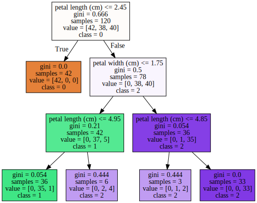
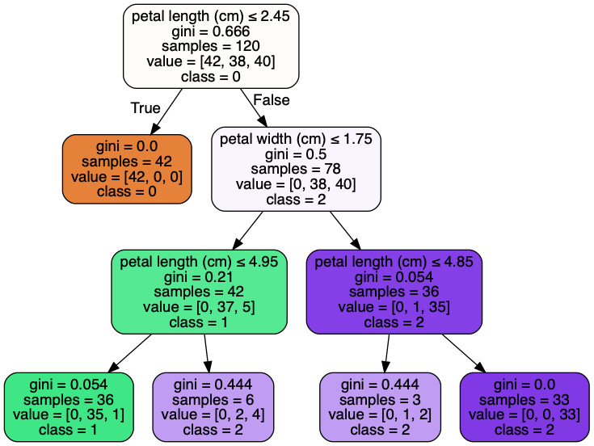

**决策树**

决策树是一种基本的分类方法，也可以用于回归。决策树模型呈树形结构。在分类问题中，表示基于特征对实例进行分类的过程，它可以认为是$if-then$规则的集合。在决策树的结构中，每一个实例都被一条路径或者一条规则所覆盖。通常决策树学习包括三个步骤: 特征选择、决策树的生成和决策树的修剪。


**决策树算法(贪心算法)**

- 有监督的学习

- 非参数学习算法

- 自顶向下递归方式构造决策树

- 在每一步选择中都采取在当前状态下最好/优的选择


  决策树学习的算法通常是一个递归地选择最优特征，并根据该特征对训练数据进行分割，使得各个子数据集有一个最好的分类的过程。

在决策树算法中，ID3基于**信息增益**作为属性选择的度量，**C4.5**基于**信息增益**作为属性选择的度量，**CART**基于**基尼指数**作为**属性选择**的度量。


**决策树优缺点**

优点:

- 速度快: 计算量相对较小，且容易转化成分类规则。只要沿着树根向下一直走到叶， 沿途的分裂条件就能够唯一确定一条分类的谓词。
- 准确性高: 挖掘出来的分类规则准确性高，便于理解，决策树可以清晰的显示哪些字段比较重要，即可以生成可以理解的规则。
- 可以处理连续和种类字段。
- 不需要任何领域知识和参数假设。
- 适合高维数据。
- 对缺失值不敏感
- 可以处理逻辑回归等不能解决的非线性特征数据。

缺点:

- 对于各类别样本数量不一致的数据，信息增益偏向于那些更多数值的特征。

- 容易过拟合。

- 忽略属性之间的相关性。


**ID3决策树(信息增益)**

“信息熵”是度量样本集合纯度最常用的一种指标。假定当前样本集合$D$中第$k$类样本所占的比例为$p_k(k=1,2,...,\mid\gamma\mid),$则$D$的信息熵定义为

$Ent(D)=-\sum_{k=1}^{\mid\gamma\mid}p_klog_2p_k$

$Ent(D)$的值越小，则$D$的纯度越高

假定离散属性$a$有$V$个可能的取值${a^1,a^2,...,a^V},$若使用$a$来对样本集$D$进行划分，则会产生$V$个分支结点，其中第$v$个分支结点包含了$D$中所有在属性$a$上取值为$a^v$的样本，记为$D^v$。

$Gain(D,a)=Ent(D)-\sum_{v=1}^{V} \frac{\mid D^v\mid}{\mid D\mid}Ent(D^v)$

信息增益越大，则意味着使用属性$a$来进行划分所获得的“纯度提升”越大。

$a_* = arg_{a\in A}maxGain(D,a)$


**C4.5决策树(增益率)**

减少信息增益对可取值数目较多的属性的偏好。

$IV(a)=-\sum^V_{v=1}\frac{\mid D^v\mid}{\mid D\mid}log_2\frac{\mid D^v\mid}{\mid D\mid}$

$Gain\space ratio(D,a)=\frac{Gain(D,a)}{IV(a)}=1-\sum_{k=1}^{\mid\gamma\mid}p_k^2$

信息率越大，则意味着使用属性$a$来进行划分所获得的“纯度提升”越大。


**CART决策树(基尼系数)**

$Gini(D)=\sum_{k=1}^{\mid\gamma\mid}\sum_{k'\neq k}p_kp_{k'}=1-\sum_{k=1}^{\mid\gamma\mid}p_k^2$

$Gini\space index(D,a)=\sum^V_{v=1}\frac{\mid D^v\mid}{\mid D\mid}Gini(D^v)$

划分后基尼指数最小的属性作为最优划分属性

$a_* = arg_{a\in A}min\ Gini\_index(D,a)$


**参数详解**

- **criterion**：gini 或者 entropy，前者是基尼系数，后者是信息熵。
- **splitter**：best 或者 random，前者是在所有特征中找最好的切分点，后者是在部分特征中，默认的best适合样本量不大的时候，而如果样本数据量非常大，此时决策树构建推荐random。
- **max_features**：int，float，None(所有)，log2，sqrt，特征小于50的时候一般使用所有的
- **max_depth**：int 或者 None，设置决策随机森林中的决策树的最大深度，深度越大，越容易过拟合，推荐树的深度为：5-20之间。
- **min_samples_split**：设置结点的最小样本数量，当样本数量可能小于此值时，结点将不会在划分。
- **min_samples_leaf**：这个值限制了叶子节点最少的样本数，如果某叶子节点数目小于样本数，则会和兄弟节点一起被剪枝。
- **min_weight_fraction_leaf**：这个值限制了叶子节点所有样本权重和的最小值，如果小于这个值，则会和兄弟节点一起被剪枝默认是0，就是不考虑权重问题。
- **max_leaf_nodes**：通过限制最大叶子节点数，可以防止过拟合，默认是"None”，即不限制最大的叶子节点数。
- **class_weight**：指定样本各类别的的权重，主要是为了防止训练集某些类别的样本过多导致训练的决策树过于偏向这些类别。这里可以自己指定各个样本的权重，如果使用balanced，则算法会自己计算权重，样本量少的类别所对应的样本权重会高。
- **min_impurity_split**：这个值限制了决策树的增长，如果某节点的不纯度(基尼系数，信息增益，均方差，绝对差)小于这个阈值则该节点不再生成子节点。即为叶子节点 。


**对鸢尾花数据集进行分类**
```python
import matplotlib.pyplot as plt
from sklearn import datasets
from sklearn.tree import DecisionTreeClassifier
from sklearn.model_selection import train_test_split

iris = datasets.load_iris() # 加载鸢尾花数据集
x = iris.data
y = iris.target
labels = iris.feature_names  

x_train, x_test, y_train, y_test = train_test_split(x, y, test_size=0.2, random_state=666) # 对数据集进行分割

dt_clf = DecisionTreeClassifier(max_depth=3) # 构建决策树模型
dt_clf.fit(x_train, y_train) # 训练

dt_clf.score(x_test, y_test) # 测试集进行测试
# 1.0
```


**决策树可视化**

```python
#	基于jupyter的决策树可视化

# 方法一
from sklearn import tree
from IPython.display import SVG
from graphviz import Source
from IPython.display import display

graph = Source(tree.export_graphviz(dt_clf, out_file=None
   , feature_names=labels, class_names=['0', '1', '2'] 
   , filled = True))

display(SVG(graph.pipe(format='svg')))
```



```python
# 方法二
from sklearn import tree
from sklearn.externals.six import StringIO
from IPython.display import Image
import pydotplus

dot_data = StringIO()
tree.export_graphviz(dt_clf, out_file=dot_data, feature_names=labels, class_names=['0', '1', '2'], filled=True, rounded=True, special_characters=True)
graph = pydotplus.graph_from_dot_data(dot_data.getvalue())
Image(graph.create_png())
```

